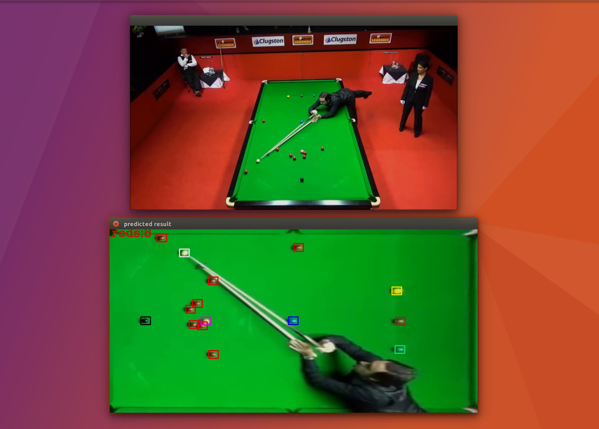
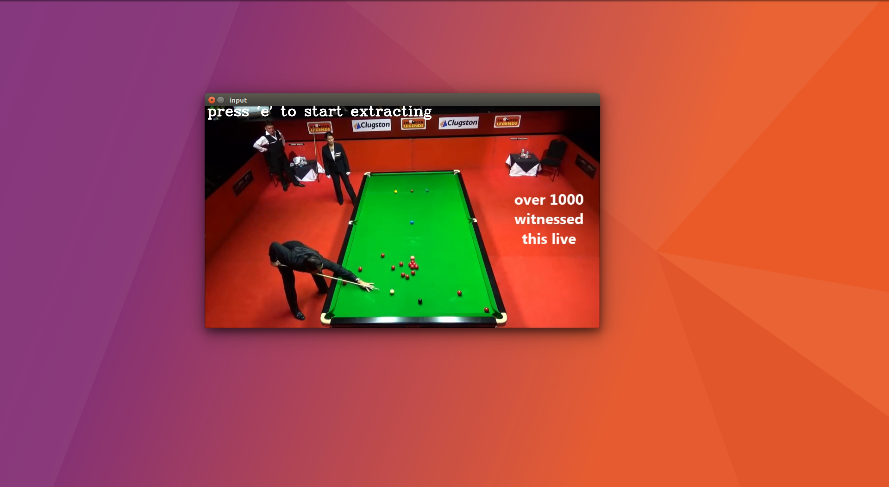
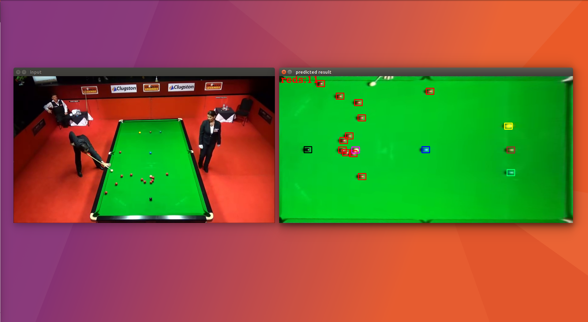

# Snooker_Vision_Project
This project uses machine learning and image processing to extract a snooker frame from a mounted camera feed and transform it provide a top view of the frame. Machine learning and segmentation is used to detect and classify the balls into their respective colors. This system keeps a track of all the red balls on the table and can be modified to form an autonomous pointing system.

The coding style makes extensive use of pipelines modules from sklearn.

The dataset/balls/balls/ directory consists of images of snooker balls in 'labeled' folders. pipeline_draft.py uses pipelines to extract these images and performs the passed computations and feature extraction on the dataset and saves the dataset into the folder dataset/balls/preprocessedDataPipeline folder using cPickle module

Some pretrained classifiers can  be found in predictors folders.

The dataset can be processed in ovo ( colour classification ) and ova ( ball/ not ball for false positives) mode. The classifiers have been trained and saved on each of these modes and with various preprocessing indicated by the prefix of file  names.

hue  --> HSV colorspace ( only h vector)

gray --> grayscale images

hog --> HOG descriptors

# Demo.
 First go to the project directory.
 
1. Create a virtual environment for this project( optional)
2. Use req.txt to install dependent modules thorugh pip
    `pip install -r req.txt`
3. Install OpenCV.
    Any version should work, but > 3.0 is recommended.
    
    Note: You may have to build it. In which case, make sure you copy the cv2.so file into 
    the virtualenv's sitepackes directory.
    
4. run `python main.py`

Above command will use the video at `dataset/video_data/Ronnie/Ronnie-147.mp4`
and file `dataset/video_data/Ronnie/background.tiff` as input. The default hue filtering
parameter `h` is set to 52 for segmenting the frame from background.

ENJOY!
